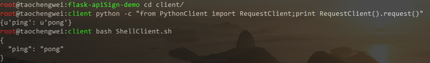
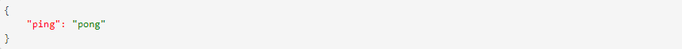

# flask-apiSign-demo
Api签名验证样例

## 使用
```
cd server ; pip install -r requirements.txt
python main.py
```

## 客户端

##### Python、Shell



##### JavaScript(HTML)



## 签名描述

#### 一、起因

  为了实现基本的防抓取机制，对绝大多数采用了 Api 签名验证，在保证签名秘钥不泄露的前提下，具有一定的数据抓取防御能力。
  1. 请求参数是否被篡改；
  2. 请求来源是否合法；
  3. 请求是否具有唯一性。

#### 二、经过

1. 前提准备
    接口提供方生成用户密钥，包含：
    1.1 accesskey_id, 标识用户
    1.2 accesskey_secret, 用户加密串(严格保管，仅用于加密不参与通信)

2. 公共参数
    2.1 accesskey_id, 标识用户
    2.2 version, 后端接口版本号
    2.3 timestamp, 10位时间戳(客户端生成时间戳可以适当减几秒)
    2.4 signature, uri请求参数签名(除signature外所有)
    *# 另可以定义其他参数，比如signMethod*

3. 签名过程
    3.1.对除签名外的所有请求参数按key做的升序排列。
      `例如：有b=2一个私有参数，另加上公共参数后，按key排序后为：accesskey_id、b、timestamp、version`

    3.2 把排序后的参数以"**参数名=参数值&**"的形式连接，末尾再加上"**accesskey_secret**"，得到拼装字符串。
      `例如：accesskey_id=test&b=2&timestamp=1511232761&version=v1&accesskey_secret`

    3.3 将上一步得到的字符串MD5加密并转化为大写。
      `例如：signature=F833B331E572FD9D3D64A8D0737490B0`

    3.4 最终请求示例。
      `timestamp=1511232761&b=2&version=v1&accesskey_id=test&signature=F833B331E572FD9D3D64A8D0737490B0`

4. 验证请求：
    4.1 验证版本(非必要)
    4.2 验证时间戳是否有效(小于等于服务器时间戳且在30s之内请求有效)
    4.3 验证accesskey_id是否有效
    4.4 验证签名

#### 三、返回

1. 正确返回
    ```
    {
        "ping": "pong"
    }
    ```

2. 错误返回
    2.1 版本错误
    ```
    {
        "msg": "Invalid version",
        "success": false
    }
    ```

    2.2 时间戳错误
    ```
    {
        "msg": "Invalid timestamp",
        "success": false
    }
    ```

#### 四、参考

1. [API接口签名验证(详细描述主流签名方式)](http://www.hello1010.com/api-sign "API接口签名验证(详细描述主流签名方式)")

2. [Api：签名验证机制(提及关于POST签名说明)](https://github.com/Eliacy/YYMiOS/wiki/Api%EF%BC%9A%E7%AD%BE%E5%90%8D%E9%AA%8C%E8%AF%81%E6%9C%BA%E5%88%B6 "Api：签名验证机制(提及关于POST签名说明)")
